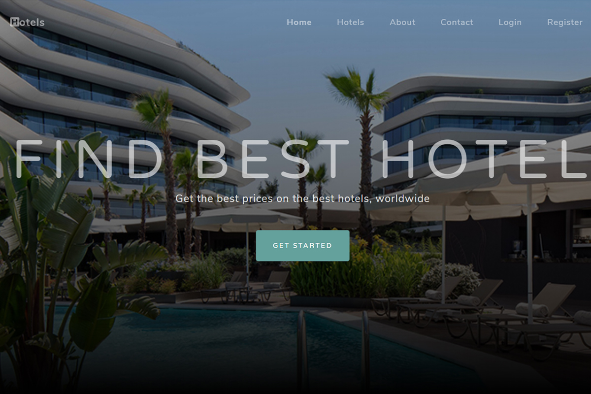

# Hotels Website

[Link to Demo](http://portfolio.alexandrpasko.com)

Hotels is a database driven, dynamically generated multi-page website where people can search a hotel that fits them the best. The website is created on PHP MVC framework, which makes the code easy to navigate and maintain. Layout of the website is based on Bootstrap template. There is also an admin website where a user with administrative rights has access to full CRUD.

## Technologies/Languages:
* PHP
* SQLite
* JavaScript
* Laravel PHP
* Bootstrap

## Screenshot:
